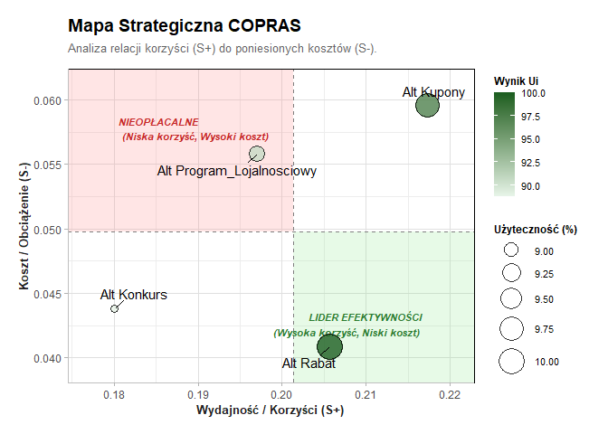

<!-- README.md is generated from README.Rmd. Please edit that file -->

# MarkRankR

<!-- badges: start -->

<!-- badges: end -->

Pakiet MarkRankR to kompleksowe narzędzie do Wielokryterialnej Analizy
Decyzyjnej (MCDA) w środowisku rozmytym. Umożliwia pełną ścieżkę
analityczną: od surowych ankiet, przez wyznaczanie wag metodą BWM
(Best-Worst Method), aż po rankingi metodami VIKOR i COPRAS.

## Instalacja

Możesz zainstalować wersję deweloperską z serwisu
[GitHub](https://github.com/) (po opublikowaniu):

``` r
# install.packages("devtools")
devtools::install_github("ruzrom/MarkRankR")
```

## Szybki start

Oto podstawowy przykład użycia pakietu z wykorzystaniem wbudowanych
danych:

``` r
library(MarkRankR)

# 1. Wczytaj dane
data("promocje_dane_surowe")

# 2. Przygotuj macierz rozmytą
# Definiujemy, które kolumny tworzą kryteria
skladnia <- "
  Koszt =~ koszt_wdrozenia; 
  Sprzedaz =~ wzrost_sprzedazy; 
  Lojalnosc =~ lojalnosc_klientow;
  Atrakcyjnosc =~ atrakcyjnosc_klienta;
  Latwosc =~ latwosc_realizacji
"

macierz <- przygotuj_dane_mcda(promocje_dane_surowe, skladnia, kolumna_alternatyw = "Alternatywa")

# 3. Oblicz ranking metodą Fuzzy COPRAS
wynik <- rozmyty_copras_promo(
  macierz, 
  typy_kryteriow = c("min", "max", "max", "max", "max"),
  bwm_kryteria = c("Koszt", "Sprzedaz", "Lojalnosc", "Atrakcyjnosc", "Latwosc"),
  bwm_najlepsze = c(3, 1, 6, 4, 8),
  bwm_najgorsze = c(6, 8, 3, 2, 1)
)
#> Obliczanie wag metodą BWM...

# 4. Wyświetl wynik
print(wynik$wyniki)
#>             Alternatywa Piorytety_Qi Uzytecznosc_Ui Ranking
#> 1               Konkurs       4.7284          88.79       4
#> 2                Kupony       5.1996          97.64       2
#> 3 Program_Lojalnosciowy       4.8524          91.12       3
#> 4                 Rabat       5.3254         100.00       1

# 5. Wyświetl mapę decyzyjną
plot(wynik)
```


